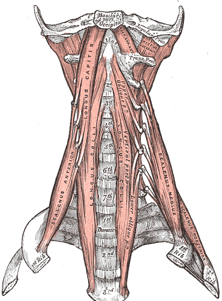
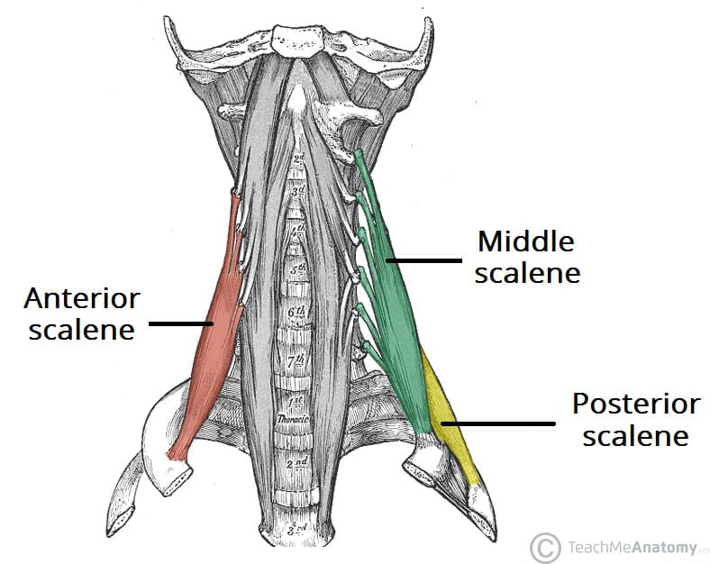
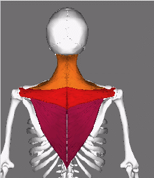

# Anatomy

## Gallbladder

[docs](https://www.betterhealth.vic.gov.au/health/conditionsandtreatments/gallbladder-gallstones-and-surgery)
The gallbladder is a small organ that holds digestive juice produced by the `liver` to break down `dietary fats`.

## Muscles

Muscles have at least points of interest. Their attachment locations, their function, their blood supply, and their innvervation (where the nerve goes to the muscle).

The attachment locations tend to be `origin` or `insertion`. The origin is the place where it is fixed or less movable. While the `insertion` is the movable end that gets pulled towards the origin when the muscle contracts.

### Neck

### Deep neck flexors

[docs](https://www.physio-pedia.com/Cervical_Deep_Neck_Flexors)

These are the `cervical muscles` and are made up of the `Longus colli` and `Longus capitis`.

### Suboccipital Muscles

These are the muscles at the base of the head.

`Rectus Capitis Posterior Major and Minor` and `Obliquus Capitis Superior and Inferior`.

### Scalenes

[docs](https://www.physio-pedia.com/Scalene)
[docs](https://teachmeanatomy.info/neck/muscles/scalene/)

These are a group of neck muscles in the lateral neck (i.e. the front). They are the `scalenus anterior`, `scalenus medius` and `scalenus posterior`. There might be a fourth muscle `scalenus minimus` behind the anterior. Each of these muscles have different start and end connection points on the spine.

### Trapezius

[docs](https://www.physio-pedia.com/Trapezius)

These are large superficial muscles in from the back. They are made up of the descending (superior), ascending (inferior) and the middle.

It contributes to the `Scapulo-humeral rhythm` which is the lifting of the arm.

There are other muscles that it works with:

- `Rhomboids`
- `Levator Scapulae`
- `Serratus Anterior`
- `Deltoid`
- `Pectoralis Minor`
- `Latissimus Dorsi`
- `Suprastinatus`

### Rhomboids

[docs](https://www.physio-pedia.com/Rhomboids)

These are muscles that sit underneath the trapezius muscles. They are made up of two muscles the Rhomboid Major and Rhomboid Minor. Minor sits above (superior) to the Major.

### Deltoid

[docs](https://www.physio-pedia.com/Deltoid)
[docs](https://my.clevelandclinic.org/health/body/21875-deltoid-muscles)

The deltoids are shoulder muscles and are made up of the `Anterior deltoids` (the front), the `lateral deltoids` (the side) and the `posterior deltoids` (the back).

The anterior deltoids are connected to the the `clavicle`. The lateral deltoids connect to the `acromion` (the bony part of the scapula) and posterior deltoid connects to the flat surface of the `scapula`.

### Levator Scapulae

[docs](https://en.wikipedia.org/wiki/Levator_scapulae_muscle)

This is a muscle in the back and side of the neck. It's main purpose is to lift the scapula. It connects to the C1-4 vertebrae and medial border of the scapula.

### Serratus Anterior

## Bones

Bones have several points of interest, their `ossification` (which is how they are grown),

### Scapula

[docs](https://www.physio-pedia.com/Scapula)

This is a bone triangular shaped bone in the back.

There are a few sections of the scapula. These are `coracoid process`, `acromion`, various tubercles, surfaces, borders, angles.

#### Surfaces

##### Front / subscapular Fossa

##### Back

##### Side

#### Angles

##### Superior angle / media angle

##### Inferior angle

##### lateral angle / glenoid angle / head of the scapula

##### Anatomic neck

##### Surgical neck

#### Borders

##### Superior border

##### Axillary border

##### Medial border

### Vertebrae

## Movements

### Scapulo-humeral rhythm

This is the movement associated with lifting your arm up. The `scapula` and `humerus` move in a 1:2 ratio. The arm is lifted up 180 deg, where the scapula moves 60 deg and the humerus moves the 120 deg.
